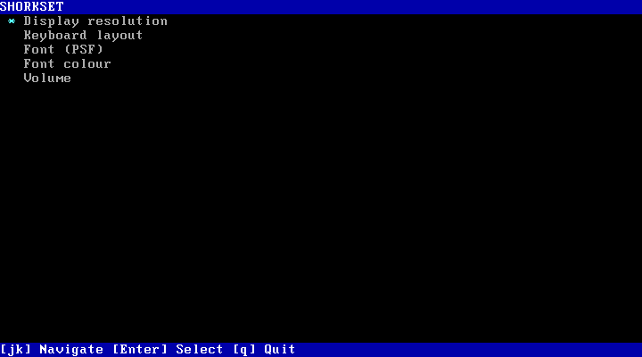
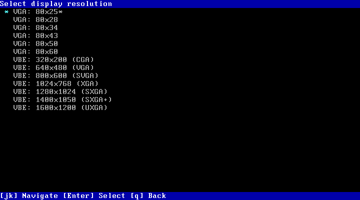
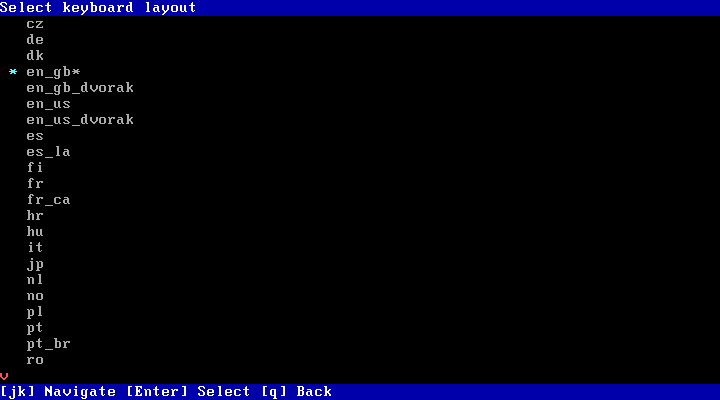
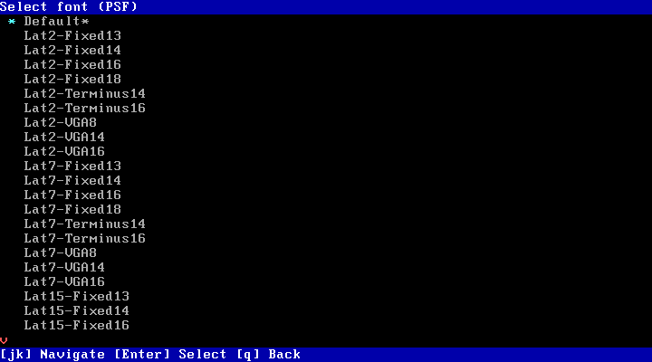
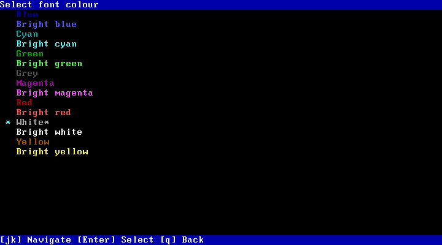
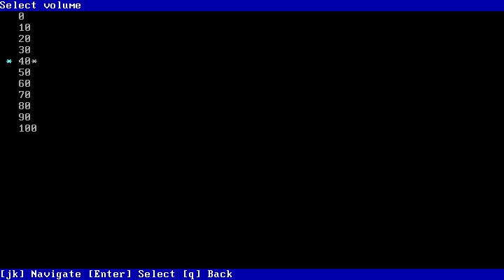

# SHORKSET

A settings program for SHORK Operating Systems such as [SHORK 486](https://github.com/SharktasticA/SHORK-486) that allows you to change the VGA or VBE display resolution, keyboard layout (keymap), terminal PSF font, terminal font colour, and system sound volume.

## Screenshots

<table style="table-layout: fixed; width: 100%;">
  <tr>
    <td style="width: 50%; text-align: center;"></td>
    <td style="width: 50%; text-align: center;"></td>
  </tr>
  <tr>
    <td style="width: 50%;">Main menu</td>
    <td style="width: 50%;">Select display resolution</td>
  </tr>
</table>

<table style="table-layout: fixed; width: 100%;">
  <tr>
    <td style="width: 50%; text-align: center;"></td>
    <td style="width: 50%; text-align: center;"></td>
  </tr>
  <tr>
    <td style="width: 50%;">Select keyboard layout</td>
    <td style="width: 50%;">Select font (PSF)</td>
  </tr>
</table>

<table style="table-layout: fixed; width: 100%;">
  <tr>
    <td style="width: 50%; text-align: center;"></td>
    <td style="width: 50%; text-align: center;"></td>
  </tr>
  <tr>
    <td style="width: 50%;">Select font colour</td>
    <td style="width: 50%;">Select volume</td>
  </tr>
</table>
